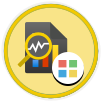
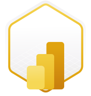

# Microsoft Learn Achievements

I am learning Data Analytics and continuously improving my skills through Microsoft Learn programs.

---

## 1️⃣ Discover Data Analysis

I earned the **"Discover Data Analysis"** badge from Microsoft Learn.

### Skills Learned
- Fundamentals of Data Analysis
- Data-driven Decision Making
- Understanding Data Sources
- Analytical Thinking

### Concepts
- Data Interpretation
- Business Insights

### Badge

---

## 2️⃣ Get Started Building with Power BI

I earned the **"Get Started Building with Power BI"** badge.

### Skills Learned
- Data Visualization
- Dashboard Creation
- Data Modeling Basics
- Business Insights

### Tool
- Microsoft Power BI

### Badge

---
